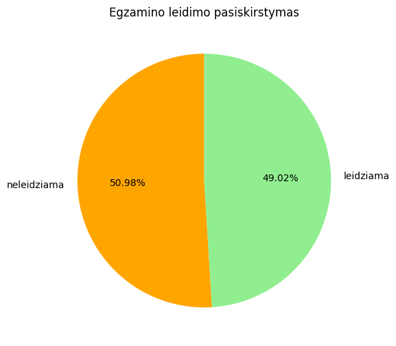

This repository contains 2 files with small dataset of students and their grades in .txt and .csv format.

Main tasks were to unpack and analyse these files using Pyhton code and Panda library, and also to add some visualizations.

Tasks, variables and code comments are in Lithuanian language.

Here are the charts for Students average grade:
### Chart Set 

